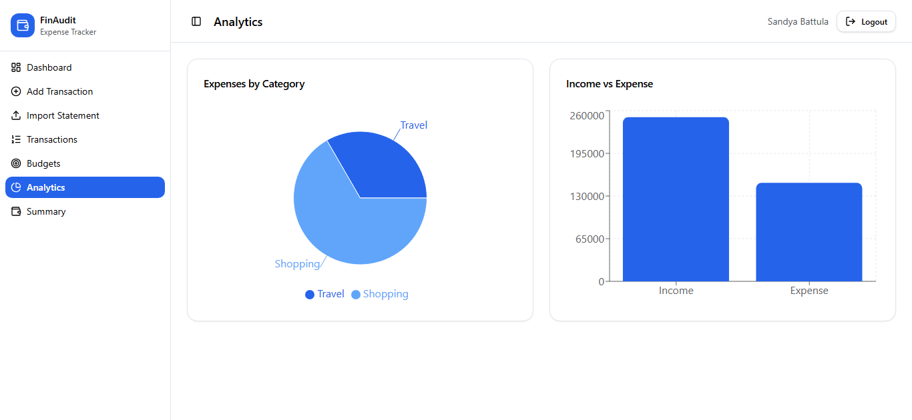
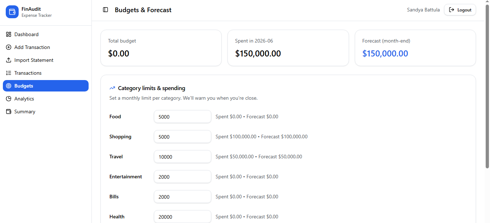
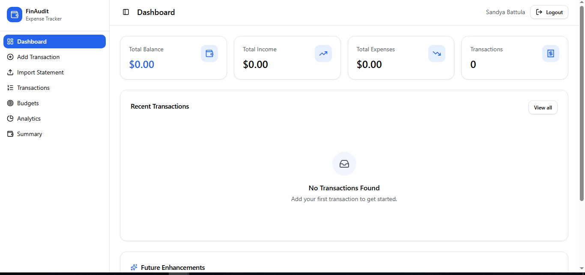
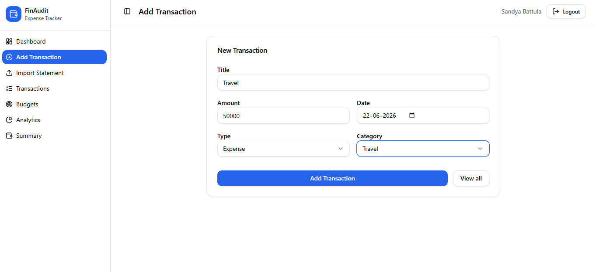
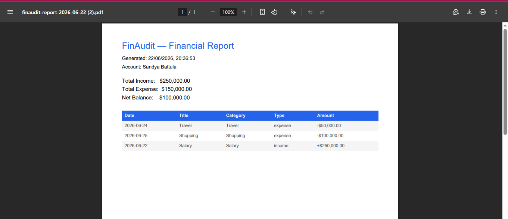

# 💰 FinAudit – Smart Expense Tracker & Financial Auditor

<p align="center">
  <b>An Offline-First Personal Finance Management Platform</b><br>
  Track expenses, manage budgets, analyze spending habits, import bank statements, and generate professional audit reports.
</p>

---

## 📌 Project Overview

FinAudit is a modern financial management application that helps users efficiently manage their personal finances. The platform enables users to record income and expenses, visualize spending patterns, set monthly budgets, import bank transaction statements, and generate financial audit reports.

The application follows an **offline-first architecture**, ensuring data privacy and accessibility without requiring cloud storage or external databases.

---

## 🚀 Features

### 🔐 Authentication
- Secure User Registration & Login
- SHA-256 Password Hashing
- Session Persistence
- Offline Authentication
- User-Specific Data Isolation

### 💳 Transaction Management
- Add Income & Expense Transactions
- Search and Filter Transactions
- Delete Transactions
- Persistent Local Storage

### 📥 CSV Import
- Import Bank Statements
- Smart Transaction Parsing
- Automatic Expense Categorization
- Preview Before Import

### 🎯 Budget Management
- Monthly Budget Allocation
- Category-wise Budget Tracking
- Spending Limit Alerts
- Forecast-Based Budget Warnings

### 📊 Analytics Dashboard
- Expense Distribution Pie Chart
- Income vs Expense Bar Chart
- Interactive Financial Insights

### 📄 Export Reports
- CSV Export
- Professional PDF Audit Reports
- Downloadable Financial Records

### 📅 Monthly Summary
- Monthly Income
- Monthly Expenses
- Total Savings
- Savings Percentage

---

## 🏗️ System Architecture

```text
User Interface (React + TanStack Start)
            │
            ▼
Business Logic Layer
(Transaction Management, Budgeting, Analytics)
            │
            ▼
Local Storage Layer
(User Accounts, Transactions, Budgets)
            │
            ▼
Reporting & Visualization
(Recharts, CSV Export, PDF Reports)
```

## 🛠️ Technology Stack

| Category | Technology |
|-----------|------------|
| Frontend | React 19 |
| Framework | TanStack Start v1 |
| Routing | File-Based Routing |
| Styling | Tailwind CSS v4 |
| UI Components | shadcn/ui |
| Charts | Recharts |
| PDF Generation | jsPDF + jspdf-autotable |
| Build Tool | Vite 7 |
| Storage | Browser Local Storage |
| Authentication | SHA-256 Hashing |

---

## 📂 Project Structure

```text
src/
├── routes/
│   ├── Dashboard
│   ├── Login
│   ├── Register
│   ├── Add Transaction
│   ├── Transactions
│   ├── Import Statement
│   ├── Budgets
│   ├── Analytics
│   └── Summary
│
├── components/
│   ├── AppSidebar
│   ├── Header
│   └── EmptyState
│
├── lib/
│   ├── auth.ts
│   ├── transactions.ts
│   ├── categorize.ts
│   └── reports.ts
│
└── styles.css
```

---

## Advantages

- No Database Required
- Offline Access
- Faster Performance
- Secure Local Storage
- User-Specific Data Isolation

---

## Smart Auto-Categorization

Transactions are automatically categorized using keyword-based pattern matching.

| Category | Examples |
|-----------|----------|
| Food | Restaurant, Starbucks, Grocery |
| Travel | Uber, Lyft, Airbnb |
| Shopping | Amazon, Flipkart |
| Bills | Electricity, Internet, Rent |
| Entertainment | Netflix, Spotify |
| Health | Pharmacy, Hospital |
| Education | Udemy, Coursera |
| Other | Default Category |

---

## 📸 Screenshots

### Dashboard



### Budget Management



### Analytics Dashboard



### Transaction Management



### PDF Report Export



---

## 🔮 Future Enhancements

- AI Budget Prediction
- Expense Recommendation Engine
- Cloud Synchronization
- OCR Receipt Scanning
- Voice Expense Entry
- Multi-Device Access
- Investment Portfolio Tracking
- Advanced Financial Forecasting

---

## 👥 Team Streak

### Team Members

| Name | Role | SUC Number | Roll Number |
|--------|--------|------------|------------|
| Satyaveni Bonthu | Team Lead | 2460850348 | 18 |
| Sandya Battula | Team Member | 2460850352 | 19 |
| Santhoshi Karagana | Team Member | 2460850362 | 20 |
| Kankshitha Oduru | Team Member | 2460850390 | 34 |
| Ramya Sri | Team Member | 2460850326 | 15 |

**Campus:** Aditya ASLW  
**Class & Section:** BCA - B

---

## 🎯 Project Outcomes

✅ Offline-First Financial Management System

✅ Secure Local Authentication

✅ Budget Planning & Forecasting

✅ CSV Import & Export

✅ PDF Audit Report Generation

✅ Interactive Analytics Dashboard

✅ Responsive User Interface

---

## 📜 License

This project was developed for academic and educational purposes.

---

<p align="center">
⭐Thank You⭐
</p>
